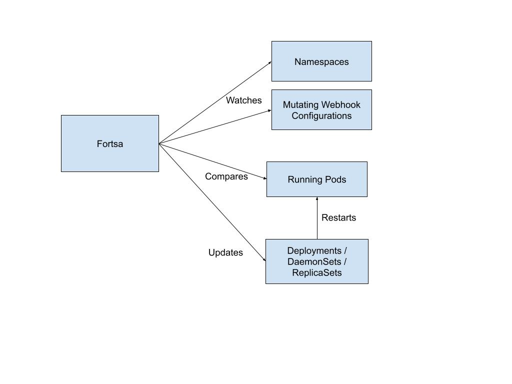

# istio-fortsa

<!-- markdownlint-disable MD033 -->


Keep Istio's data-plane up-to-date automatically.

## Name

The name comes from the Greek phrase "Όρτσα τα πανιά!" meaning roughly "Full Sail Ahead"

## Description

When updating Istio, one particular task is pretty much impossible to do with a GitOps-style
workflow: Restarting all the pods running the previous versions of Istio's sidecar proxy. This
is an onerous task even when doing everything via scripts or using something like Ansible. It
can take hours - or even longer - and it's easy to make mistakes. An that's just for a single
medium-sized cluster. If you have many clusters, keeping Istio's data-plane up-to-date can be
a full-time job!

This project is a Kubernetes Operator that automates away the whole task, as much as possible.

In the spirit of being as simple as possible, there are currently no CRDs and no dependencies
other than running in a cluster that uses Istio. Note that we've only tested this when using
Istio's default envoy-based proxy.

## Inspiration

This project was inspired by my experience with the toil of keeping the istio data-plane
up-to-date and then discovering the solution Google had come up with, described in this
YouTube video: <https://youtu.be/R86ZsYH7Ka4>

## Getting Started

### Prerequisites

- go version v1.24.0+
- docker version 17.03+.
- kubectl version v1.11.3+.
- Access to a Kubernetes v1.11.3+ cluster running Istio (lowest version not yet determined)

### To Deploy on the cluster

This project is packaged for deployment using Helm or OLM. See the "Packages" for the
various docker images available. The helm repo is here:

```text
https://hercynium.github.io/istio-fortsa/
```

Installation should be like any other app packeged for Helm or OLM depending on the
method you want to use.

## Architecture

Fortsa is a relatively simple Kubernetes Operator with limited ability to interact with
the cluster. Primarily, it does the following:

- Watches the configuration of Istio’s MutationWebhookConfiguration objects as well as the
configuration of certain Istio-related namespace labels and annotations.
- Compares the Istio configuration with the configuration of pods running in Istio-enabled namespaces
- Updates the objects controlling the pods to cause them to gracefully restart.

<!-- markdownlint-disable MD033 -->


When a workload pod is restarted in this way, it automatically gets re-configured with an updated
proxy sidecar container. This works because Istio-enabled pods are mutated by Istio’s own
MutatingWebhooks in order to inject a sidecar proxy container whose version matches that of the
control-plane configuration. These webhooks are not a part of Fortsa, they are part of Istio.

When deployed via its Helm chart, Fortsa is configured with RBAC permissions to only perform the
actions necessary for its operation, on only the objects it needs to act upon.

The only changes Fortsa makes within a running Kubernetes cluster are to update pods’ controllers
(typically Deployments, DaemonSets, or ReplicaSets) with a well-known annotation. Adding or
updating this annotation is what causes the controller to initiate a controlled restart of the
pods. This is in fact the same exact mechanism used by the command-line tool `kubectl` when issuing
a `rollout restart`.

Fortsa currently has no CRDs and there are no plans to introduce any.

Fortsa is written in Go, and compiles to a single binary that is deployed via a bare container with
only the binary (FROM scratch, in Docker parlance)

Fortsa does not require access to anything outside the cluster, not access to any applications other
than the k8s API. It does not listen on any ports except for liveness/readiness checks and metrics.

## Project Distribution

When a release is published, the project uses a Github Action to build several artifacts,
including Docker images of the Operator application, OLM bundle, OLM catalog, and the Helm
chart. The helm chart tarball is also attached to the release alongside the source code
archives.

Because this project was created using the operator-sdk, which itself is a wrapper around
kubebuilder, please look at the documentation for those frameworks for more info about
build, test, distribution, and deployment details.

## TODO

There's lots to do! If you want to help, see the Contributing section, below.

## Origin

Fortsa originated within [Cloudera](https://cloudera.com) in late 2024 as an SRE's
hackathon project. Realizing the potential benefit to the Istio Community, it was
subsequently open-sourced.

## Contributing

This is a young project and we can use all the help we can get! Feature requests, bug
reports, patches, documentation, testing, CI/CD, helm charts, you name it!

**NOTE:** Run `make help` for more information on all potential `make` targets

More information can be found via the [Kubebuilder Documentation](https://book.kubebuilder.io/introduction.html)

## License

Copyright 2024 Stephen R. Scaffidi

Licensed under the Apache License, Version 2.0 (the "License");
you may not use this file except in compliance with the License.
You may obtain a copy of the License at

<!-- markdownlint-disable MD046 -->
    http://www.apache.org/licenses/LICENSE-2.0

Unless required by applicable law or agreed to in writing, software
distributed under the License is distributed on an "AS IS" BASIS,
WITHOUT WARRANTIES OR CONDITIONS OF ANY KIND, either express or implied.
See the License for the specific language governing permissions and
limitations under the License.
